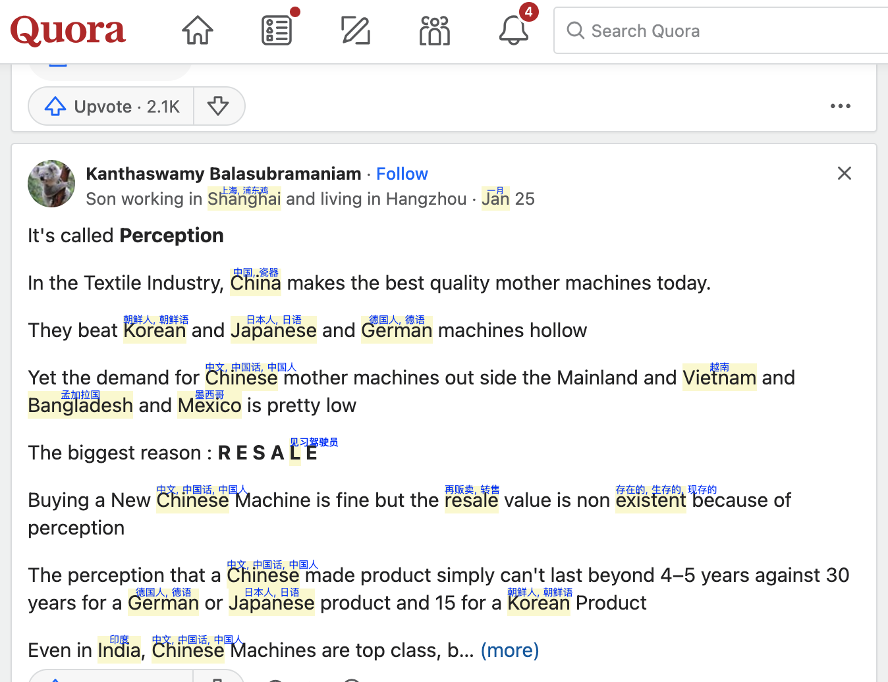
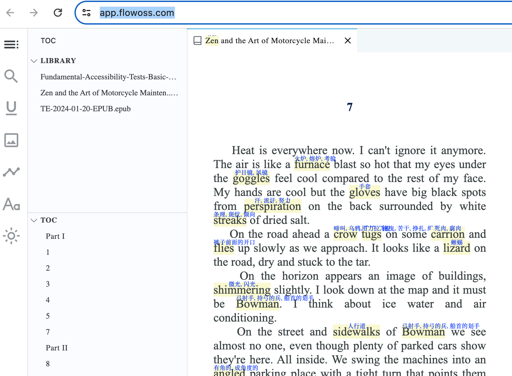
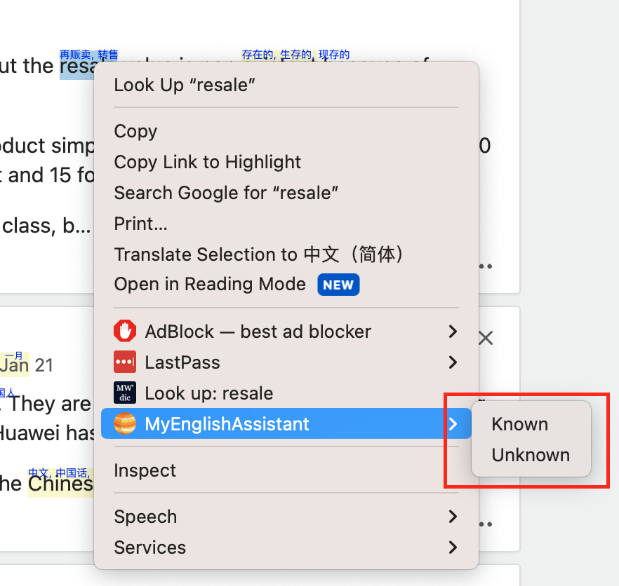

#  My English Reading Assistant

My Chrome Extension of English reader assistant

## Features

- It shows definition of the words which not in your vocabulary.

normal webpage:

online epub reader:

context menu to adjust your vocabulary:

## Install Chrome extension

refer to https://github.com/dutiyesh/chrome-extension-cli

## Contribution

Suggestions and pull requests are welcomed!.

---

This project was bootstrapped with [Chrome Extension CLI](https://github.com/dutiyesh/chrome-extension-cli)

