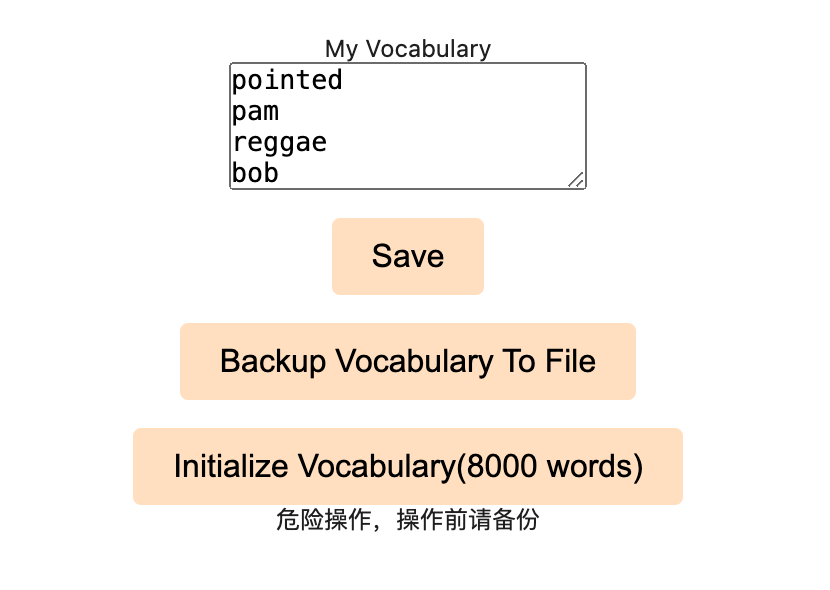
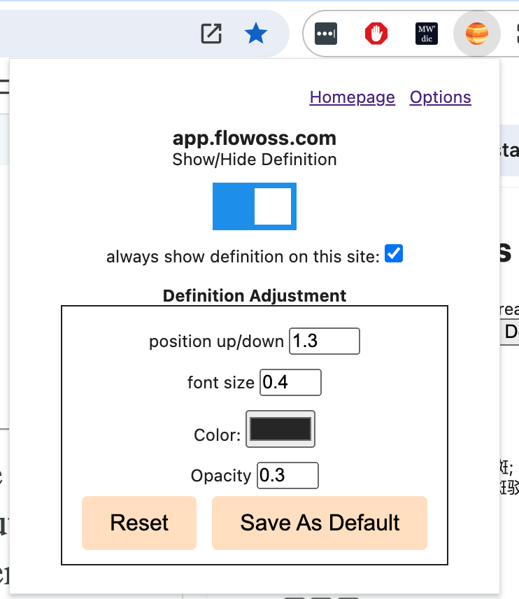
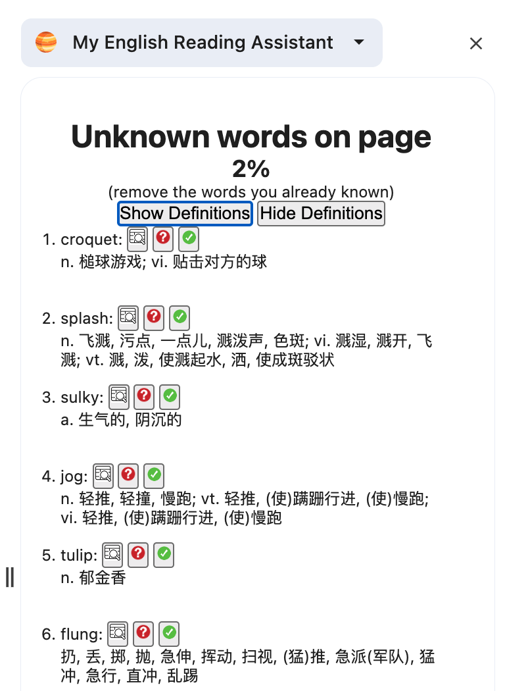
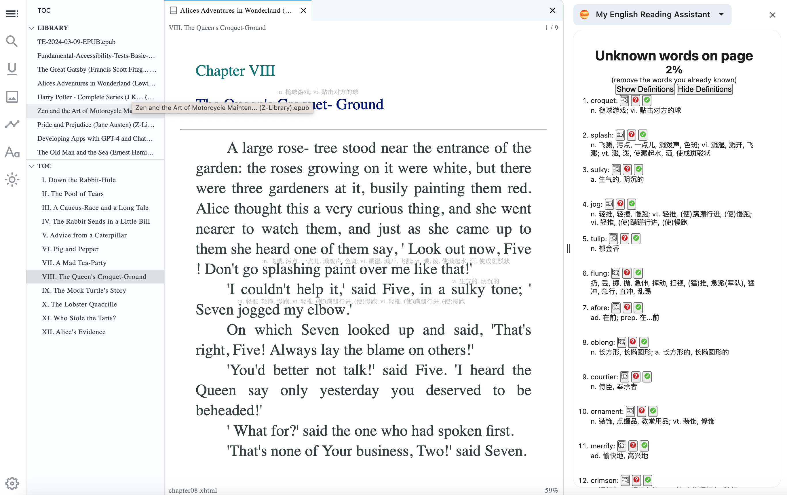

#  My English Reading Assistant

My Browser Extension of English reading assistant

# 使用说明

## 基本功能

这个浏览器插件能自动在英语网页里显示陌生单词的解释（目前只支持中文）。

想阅读英文书籍或网页，但是词汇量不够？手工为每一个生词查字典又嫌麻烦？这个软件就是为解决上述烦恼而生。

## 安装
一般用户都是从浏览器的插件市场是搜索并安装的。如果有软件开发基础的，有可能从github下载源码，自行打包，然后打开浏览器开发者模式，就可以本地安装。

## 个人词汇表
插件安装好以后，第一步是要初始化个人词汇表。因为软件是根据词汇表来确定某个单词是否认识。在弹窗上有一个按钮可以打开设置页面。

如何找到适合自己的词汇表？首先，要了解自己的词汇量水平。比如3000， 5000， 8000， 10000等。有一些网站提供了快速测试词汇量的工具。在了解了自己的词汇量以后，就可以在设置里相应的初始化词汇表了。注意，这个词汇表只是粗略的设置，想要更加精确的接近个人真实的词汇量，还需要后续的单词标记工作。

词汇表说白了就是一个文本文件，每一行一个单词。在设置页面可以复制粘贴或者编辑并保存。
如果用户自己已经有个人词汇表，则可以直接导入。

词汇表的标记也是一项需要付出的劳动，所以要定期备份。

## 弹窗
点击浏览器右上角的插件按钮，就会出现弹窗。

点击显示就可以让当前网页展示生词的释义。

也可以为某些网站设置默认自动显示。

用户根据自己的习惯还可以调整当前网站的释义的位置，字体大小，颜色，透明度等。

## 网页正文

为了让读者尽可能原汁原味的欣赏英文书籍，该软件尽量不破坏原有的文字布局。中文释义是用小号字体展示在行间空白处。为了不影响阅读体验，注释的不透明度默认为30%。这样做的目的，是让读者一般情况下不会被释义干扰，除非特意去看释义。

在阅读过程中，我们可能需要标记某个单词为“认识”或者“不认识”。

“认识”的单词会进入你的个人词汇表，从此不再展示其释义。
“不认识”的单词会移出你的个人词汇表，从而展示其释义。

鼠标左键或者右键点击某个单词，都可以标记单词为“认识”或者“不认识”。

但是这种做法有一个缺点，会打断阅读体验，建议使用侧边栏来完成单词的批量标记。

## 侧边栏

侧边栏能显示当前页面的所有生词。

生词所占比例也会显示。如果比例较高，则说明阅读难度较高。一般来说低于3%是比较舒适的阅读体验。

当读者看完整篇文章或者书籍的一章，就可以使用侧边栏批量的移除已经认识的单词，这些被移除的单词会进入个人词汇表。也有人喜欢在阅读之前先熟悉一下生词。

## 电子书

大部分英文小说都是以书籍的形式存在的。该插件也可以用于阅读epub格式的电子书。只要在浏览器内打开epub阅读器即可。

推荐阅读epub格式电子书的网站：https://app.flowoss.com/

## 显示器
最好使用4k分辨率以上的显示器，字体比较清晰，阅读体验更好。

最后，祝大家都能在这个工具的辅助下，能够顺利阅读英文小说。

## Features

- It shows definition of the words which not in your vocabulary.

## Install Chrome extension

refer to https://github.com/dutiyesh/chrome-extension-cli

## Why I made it?
作为一个英语爱好者，我一直希望自己能有阅读英文书籍的能力。但是我的英语词汇量有限，看一页内容，我都会遇到很多的生词，查字典非常低效。我看到有一些书籍是有双语版本的，电脑上也有全文翻译的软件。但是看全文翻译过的内容跟看中文版有什么区别？我希望的是在看英文书的同时，提高我的词汇量。也就是说，我希望大部分内容还是我自己来理解，少部分不认识的单词能够在旁边显示中文释义。多年来我一直没找到满足我需求的阅读软件。

2024年的某一天，我决定自己动手做一个这样的软件，首先满足我自己的需求。然后分享给有相同需求的同好们。

## Contribution

Suggestions and pull requests are welcomed!.

---

This project was bootstrapped with [Chrome Extension CLI](https://github.com/dutiyesh/chrome-extension-cli)

