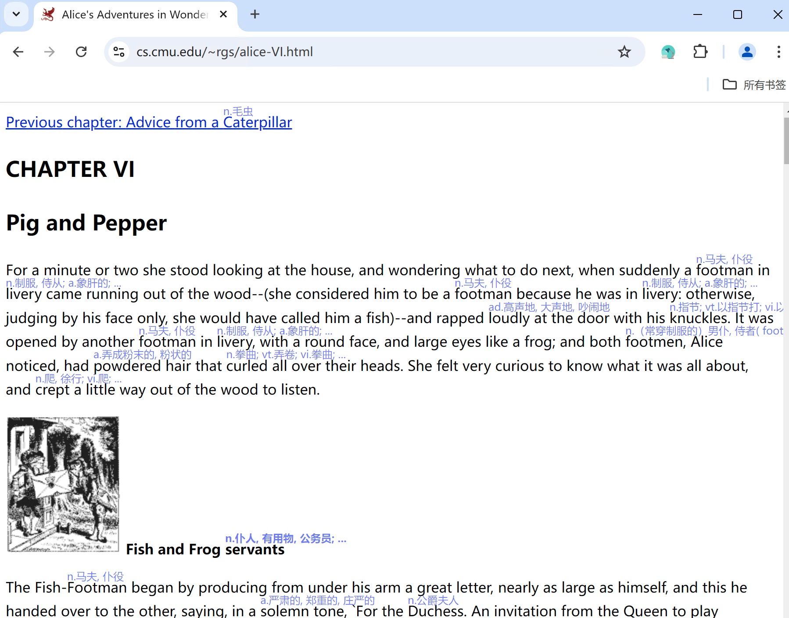
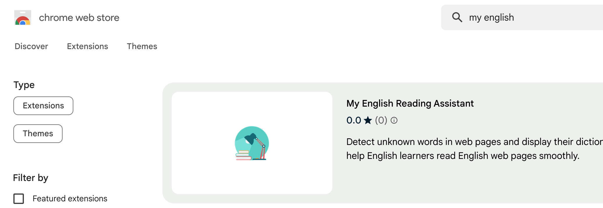
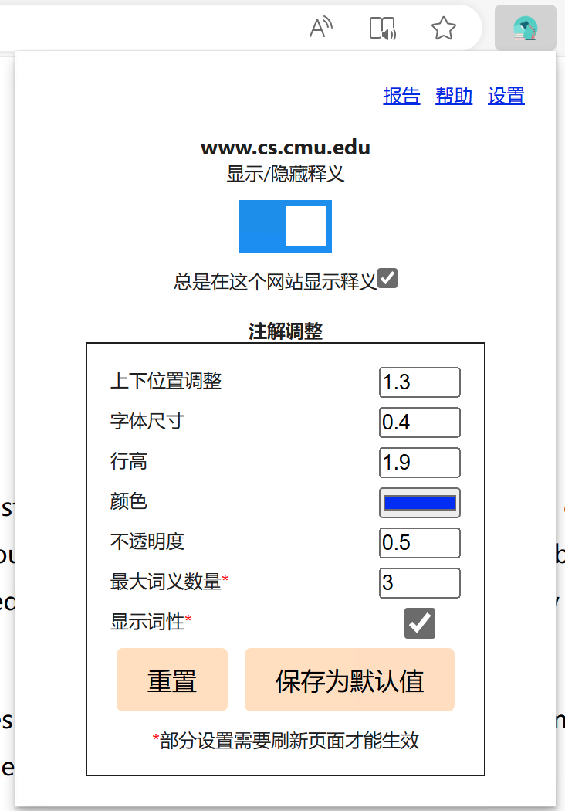
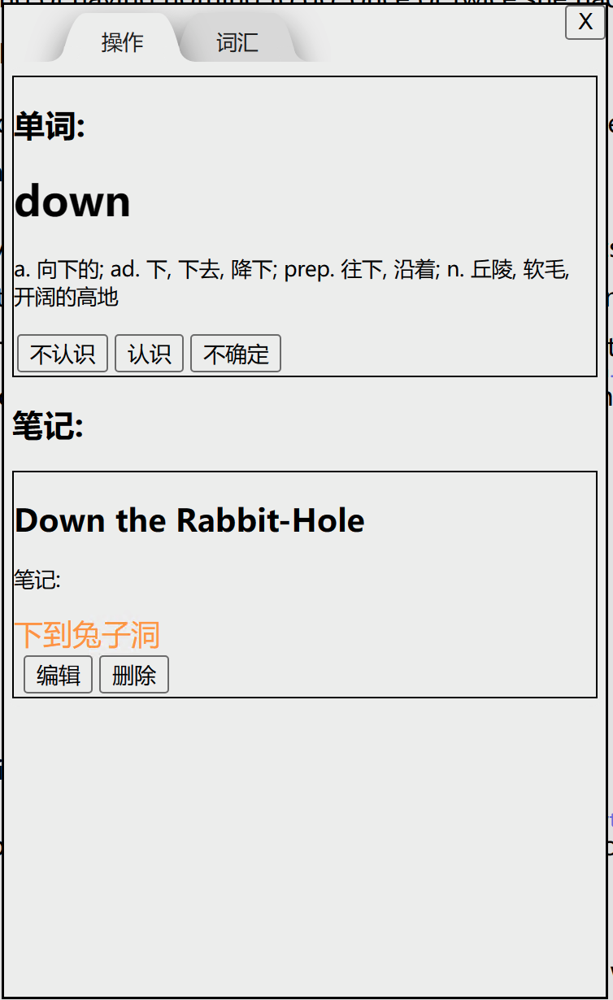
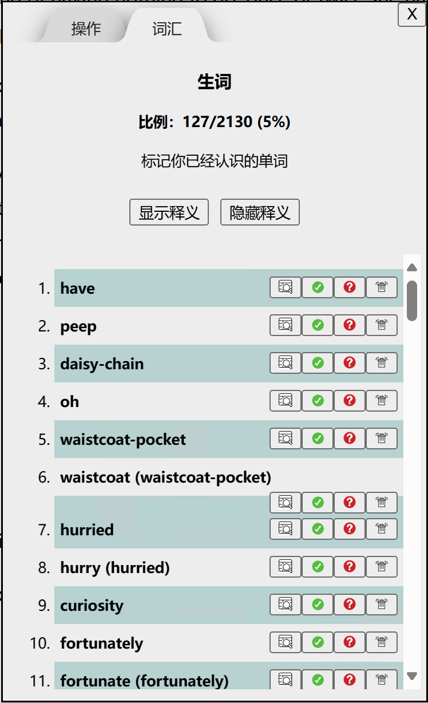
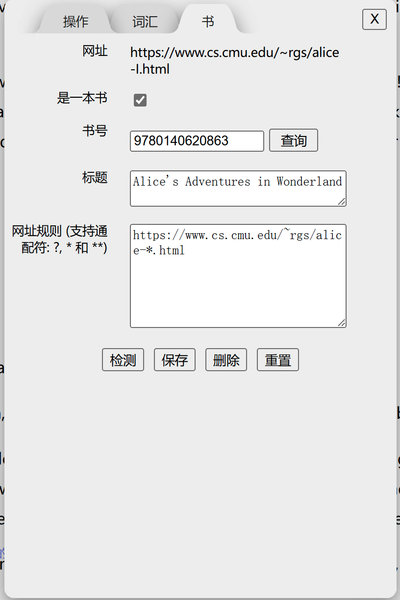
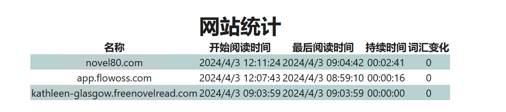
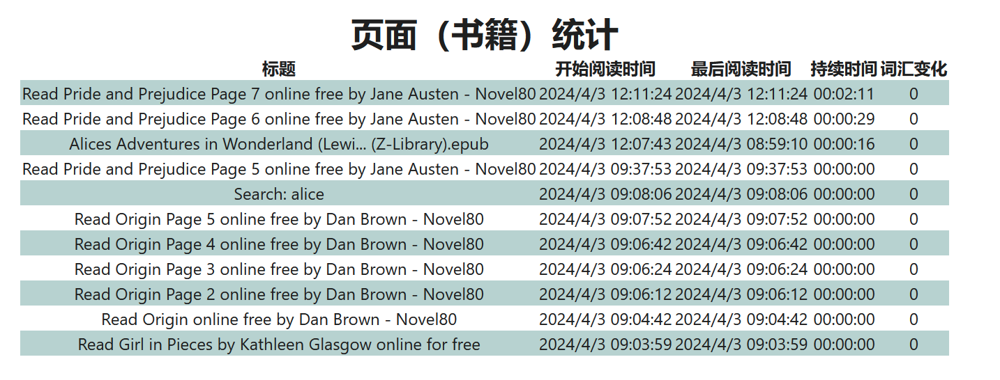
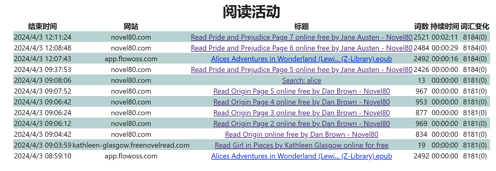
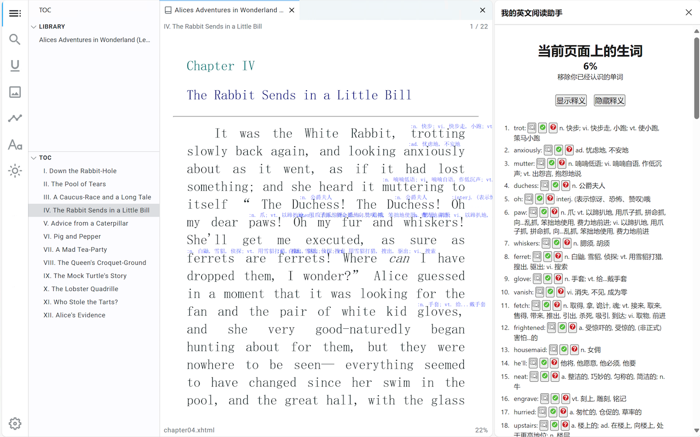

# toc

# 交流与反馈
欢迎反馈任何与软件相关的问题，以帮助改进此软件。
* [github](https://github.com/jackhatedance/my-english-reading-assistant/issues)，提交Bug
* [电子邮件](mailto:mera@dingjianghao.com)
* [贴吧](https://tieba.baidu.com/f?ie=utf-8&kw=%E6%88%91%E7%9A%84%E8%8B%B1%E6%96%87%E9%98%85%E8%AF%BB%E5%8A%A9%E6%89%8B&fr=search)
* [知乎](https://www.zhihu.com/people/ding-jack-94)

# 教学视频
如果看文档嫌麻烦，可以直接看教学视频:
* [英文阅读助手基本介绍](https://www.bilibili.com/video/BV181pMe9EDf?vd_source=1ae3868905e9e104b8689611af91b19d)
* [英文阅读助手功能介绍：看PDF报纸](https://www.bilibili.com/video/BV1TTqgYzEBa)
* [Mdict词典功能介绍](https://www.bilibili.com/video/BV1Qm5WzBELc)

# 基本功能
想阅读英文小说/报纸，但是词汇量不够，一个一个的查字典太麻烦了，坚持不下去怎么办？这个软件可以帮助你。



这个浏览器插件能自动在英语网页里显示生词的词义。

这不是一个背单词的软件。如果在阅读过程中，反复看到某个单词，顺便记住了，就可以标记为认识。无需刻意背单词。

# 安装
普通用户都是从浏览器的扩展市场是搜索并安装的。目前支持两个浏览器
* Google Chrome浏览器 (需要科学上网环境)
* 微软Edge浏览器 (无需科学上网环境)

如果有软件开发基础的，有可能从github下载源码，自行打包，然后打开浏览器开发者模式，就可以本地安装。



# 设置
## 个人词汇表
插件安装好以后，第一步是要初始化个人词汇表。因为软件是根据词汇表来确定某个单词是否认识。在弹窗上有一个按钮可以打开设置页面。


系统默认是选用“常用8000”来初始化个人词汇表的。大部分用户都需要重新选择适合自己的词汇表进行初始化。

如何找到适合自己的词汇表？首先，要了解自己的词汇量水平。在了解了自己的词汇量以后，就可以在设置里相应的初始化词汇表了。注意，这个词汇表只是粗略的设置，想要更加精确的接近个人真实的词汇量，还需要后续的单词标记工作。一般来说，看完1，2本小说以后，集中的标记工作就告一段落了。

个人词汇表说白了就是一个文本文件，每一行一个单词。在设置页面可以复制粘贴或者编辑并保存。
如果用户自己已经有个人词汇表，则可以直接复制粘贴进来，或者直接从文本文件导入。


操作完词汇表以后需要保存。

词汇表的标记也是一项需要付出的劳动，所以要定期备份。

## 词根词缀模式


许多单词是可以拆分为词根词缀的，只要我们认识词根词缀，那么这个单词的意思就大概率是理解的。比如单词hopeless是可以拆分为hope和less.那么如果这两个单词我们都认识，就可以猜测出这个hopeless的意思。

打开词根词缀模式，软件判断某个单词是否认识的逻辑如下：

1. 该单词在个人词汇表里的有记录，那么就按照记录来判定认识或者不认识。
2. 该单词在个人词汇表里的没有记录，说明用户没有明确标记过这个单词或者清除了标记，那么在开启词根词缀模式的情况下，该单词的各个部分均是“认识”的，则认为该单词也是“认识”的。判定结束。（如果这个猜测有误，用户可以明确标记）

在词汇表，词根和词缀都会列出来，允许用户把单词作为整体标记，也可以对词根词缀单独进行标记。

提供此模式的目的是减少单词标记的工作量, 也是非常符合大脑的记忆原理。

注意：词根数据库目前还在完善中。有一些单词的词根没有被拆分。

## 报告
设置是否启用报告功能。如果启用的话，则阅读活动会被记录下来，并可以查看相关的报告。


## 词典
用户可以添加词典，比如各种专业词典，比如计算机专业词典，化学专业词典等。也可以添加书籍相关的词典，比如哈利波特词典，可以包含一些小说特有的词汇。

词典可以是网络下载得到，也可以自己制作。

### 词典索引
词典需要创建索引才能快速地查询单词含义。创建索引的前提是解析词典含义。大部分词典的含义是Html格式的，没有统一的标准。每一个词典都需要经过调试才能解析。

### 附加词典
某些专业的词典不适合大部分场景，默认启用它们甚至会导致困惑。它们适合临时启用。

适合的场景举例：在阅读哈利波特系列小说时，临时附加一本相关的词典，该词典包含此小说相关的人名，地名，魔法名等词条。

这类词典适合自己制作，选用文本格式。一般词条数目也不是很大。

### 词典优先级
软件按照从上到下的顺序，逐个使用已启用的词典查询单词。一旦查询到结果，就不会继续查询余下的词典。临时附加词典具有更高的优先级。

### 词典格式
目前支持2种格式： mdict和文本。

#### MDICT格式词典
该格式比较复杂，网上有制作教程。这类词典的特点是网上资源丰富，一般用户从网上下载zip文件即可。相关网站[mdict.org](https://www.mdict.org)


#### 文本格式词典
文本格式简单易懂，适合用户自己动手制作，满足日常需要。

格式说明：
* 一行就是一个词条
* 每一行的格式: [单词] <音标> [含义列表]
* 单词后面必须有空格
* 其中音标是可选的
* 含义的格式： <词性1> [词义1],[词义2], ...; <词性2> [词义3],[词义4], ...
* 其中词性也是可选的
* 词义之间用逗号分隔，词性之间用分号分隔

举例：

最简单的例子：
```
Alice 爱丽丝
```

短语要用双引号, 并且相关的单词也要有词条：
```
Potter 波特
"Harry Potter" 哈利波特
```

比较复杂的例子：
```
good /ɡʊd/ n. 善行, 好处, 利益; a. 好的, 优良的, 上等的, 愉快的, 有益的, 好心的, 慈善的, 虔诚的
```

# 弹窗
点击浏览器右上角的插件按钮，就会出现弹窗。



点击显示就可以让当前网页展示生词的释义。

也可以为某些网站设置默认自动显示。

用户根据自己的习惯还可以调整当前网站的释义的位置，字体大小，颜色，不透明度等。

## 位置
由于释义是展示在正文的行间空隙的，所以插件默认设置的位置不一定合适，需要用户自行微调。

## 字体大小
释义字体大小相对于正文字体的比例。

## 不透明度
有时候我们阅读小说时会追求丝滑的阅读体验，即使遇到不熟悉的生词，通过上下文也可以猜测其含义。这类场景下，释义太过显眼会影响阅读正文的体验，设置不透明度低一些比较合适。

## 最大词义数量
为了避免单词释义过多，导致相邻单词的释义互相遮挡，可以设置最大数量。尽管如此，当光标浮在单词上面时，仍然会显示全部的释义。

## 显示词性
显示词性的缩写，比如n. vi. a.等。隐藏此信息的目的也是为了缩短释义。

## 生词颜色
指定生词的颜色，默认不启用。如果注重阅读体验，建议不要启用，因为它可能会干扰阅读体验；如果是精读，或者注重词汇学习，可以尝试启用。

# 网页正文

为了让读者尽可能原汁原味的欣赏英文书籍，该软件尽量不破坏原有的文字布局。中文释义是用小号字体展示在行间空白处。为了不影响阅读体验，注释的不透明度默认为30%。这样做的目的，是让读者一般情况下不会被释义干扰，除非特意去看释义。

# 侧边栏 
侧边栏已经取消。相应的内容移至内容页对话框。取消的原因是大部分浏览器不支持侧边栏，而且侧边栏的使用体验并不好。

# 对话框

## 操作


在内容页任意单词处点击鼠标左键，弹出对话框，可以对当前光标所在位置的单词或笔记（如果有的话）进行操作。
选择一段文本，弹出对话框，可以添加笔记。

## 词汇表


词汇表显示当前页面的所有生词。

生词所占比例也会显示。如果比例较高，则说明阅读难度较高。一般来说低于3%是比较舒适的阅读体验。

当读者看完整篇文章或者书籍的一章，就可以使用侧边栏批量的标记单词。也有人喜欢在阅读之前先熟悉一下生词。

默认的批量标记单词的过程是首先全部不显示释义，然后按顺序逐个标记。
对于某个单词，首先说出（或者默念）自己认为的释义，然后点击显示词典释义，如果两者基本一致，则认为自己认识此单词，就可以标记为认识。否则就无需标记。
然后进行下一个单词的标记。

如果不确定某个单词自己是否认识，可以移除标记。在开启词根词缀的模式下，这个操作是有意义的。

## 书


为了在阅读报告里正确的看到书籍的阅读记录，需要设置一下书的相关信息。不设置该信息不会影响其他功能。

### 网址
一般的网页或者epub电子书，每一个章节都是独立的网址。

### 是一本书
如果是一本书，而不是普通网页，请打勾。

### 书号
也叫ISBN。有些电子书有一个版权页，里面包含ISBN。如果没有版权页，则可以去某些网站搜索ISBN，豆瓣(book.douban.com)可以搜。

### 标题
书的标题。

### 网址规则
我们需要借助通配符映射书与网址的关系，把变化的部分用星号（*）代替。当变化的部分含子目录时，使用双星号(**)

举例1：
爱丽丝梦游仙境这本书的每一章网址如下，
* https://www.cs.cmu.edu/~rgs/alice-I.html
* https://www.cs.cmu.edu/~rgs/alice-II.html
* ......

观察可得，网址规则可以如下表示,

`
https://www.cs.cmu.edu/~rgs/alice-*.html
`

举例2：
伟大的盖茨比这本书的每一章网址如下，
* https://app.flowoss.com/#The%20Great%20Gatsby%20(Francis%20Scott%20Fitzg...%20(Z-Library).epub/OEBPS/Text/Gatsby1.xhtml
* https://app.flowoss.com/#The%20Great%20Gatsby%20(Francis%20Scott%20Fitzg...%20(Z-Library).epub/OEBPS/Text/Gatsby2.xhtml
* ......

观察可得，网址规则可以如下表示,
`
https://app.flowoss.com/#The%20Great%20Gatsby%20(Francis%20Scott%20Fitzg...%20(Z-Library).epub/**
`

### 检测
自动从当前页面检测相关信息，用户可以在此基础上修改相关信息。
* 试图从当前页面里搜索ISBN，一般只有版权页才会找到。
* 网页标题作为书籍标题，一般需要用户酌情修改
* 当前网址作为网址规则，一般需要用户手工加入通配符。

### 保存
填写完成以后需要保存。

### 删除
删除书籍相关的配置信息。

### 重置
重置当前页面。

# 报告
在设置里启用阅读报告以后可以使用该功能。数据都是保存在浏览器本地的。这个模块是为了帮助读者分析了解自己的阅读习惯，占用的时间，词汇量的增长情况。

## 词汇量变化图
可以看到过去一段时间个人词汇量的进步情况。


## 网站统计
可以看到平时常去的英文网站，所花的时间和词汇量的增长。


## 页面统计
可以看到具体页面的阅读时间和词汇量的变化。


## 阅读详情
可以看到阅读的流水账。还可以点击重新打开某个页面。


# 电子书

大部分英文小说和报刊都是以电子书的形式存在的。该插件也可以用于阅读电子书。前提是电子书必须在浏览器里打开。



已知的一些电子书的阅读器网址及其支持的格式：
|网址|格式|
|--|--|
| https://app.flowoss.com/ | epub|
| https://mozilla.github.io/pdf.js/web/viewer.html | PDF |


一些推荐的英文书

阶段一:词汇量1k-3k
* the little prince 小王子
* charlotte's web 夏洛特的蜘蛛网
* charlie and the chocolate factory 查理和他的巧克力工厂

阶段二:词汇量3k-5k
* Flipped怦然心动(多少人的入门书!)
* The Giver赐予者
* Tuesdays with Morrie相约星期二
* The ReasonlJump我想飞进天空
* The Nightingale and the Rose夜莺与玫瑰
* Letter from an Unknown Woman一个陌生女人的来信
* The Five People You Meet in Heaven你在天堂遇见的五个人

阶段三:词汇量5k-7k
* Lean in向前一步
* Animal Farm动物农场
* The Joy Luck Club喜福会
* When Breath Becomes Air当呼吸化为空气
* The Bridges of Madison County廊桥遗梦

阶段四:词汇量7k+
* Jane Eyre简爱
* Educated你当像鸟飞往你的山
* Pride and Prejudice傲慢与偏见
* The Greatest Gastby了不起的盖茨比

# 显示器
最好使用4k分辨率以上的显示器，字体比较清晰，阅读体验更好。

# 全屏模式
阅读电子书的时候，全屏模式可以尽可能减少其他视觉元素的干扰，提高阅读体验。同时建议隐藏侧边栏，目录，菜单等。 

# 沉浸式阅读
本软件提供沉浸式英文原著阅读体验，基本原则就是不打扰。具体细节如下：
* 阅读过程中尽可能不动手查字典，生词含义自动展示
* 不改变排版
* 不喧兵夺主，生词含义半透明显示
* 生词不高亮
* 不打断阅读，阅读完整篇文章以后再做单词标记


最后，祝大家都能在这个工具的辅助下，能够顺利阅读英文小说和报纸。

# 版本变化
## 0.8.4
合并单词标记按钮；支持简化词义；
## 0.8.5
允许指定生词颜色；显示阅读难度；识别被分割的单词；
## 0.8.6
修复Yahoo网站样式问题；添加贴吧入口；
## 0.8.7
支持变形词；优先查询非缩略词；支持破折号；修复PDF相关问题；添加FAQ；
## 0.8.8
修复个别单词的查询问题；修复跨元素单词的识别问题；
## 0.10.0
支持定制词典；修复pdf相关的分词问题；优化动态网页处理性能；支持西班牙和土耳其字符；
## 0.10.1
修复一些分词问题；
## 0.10.2
修复分词的问题；
## 0.10.3
支持斜杠分词；弹窗添加快速操作；
## 0.10.4
支持交错显示生词含义; 添加支持的文本HTML Tag; 识别缩写;
## 0.10.5
修复交错显示的相关问题;
## 0.11.0
Vue重做设置页面;支持音标;改进设置>笔记的内容预览;
## 0.11.1
设置>字典改进; 支持mdict字典;
## 0.11.2
修复mdict相关问题
## 0.11.3
修复mdict词典解析问题
## 0.11.4
修复mdict词典解析问题;改版悬浮提示框;改进PDF阅读性能;
## 0.11.5
保留sup等标签;改进词典页面;
## 0.12.0
悬浮框支持短语
## 0.12.1
修复一些小问题