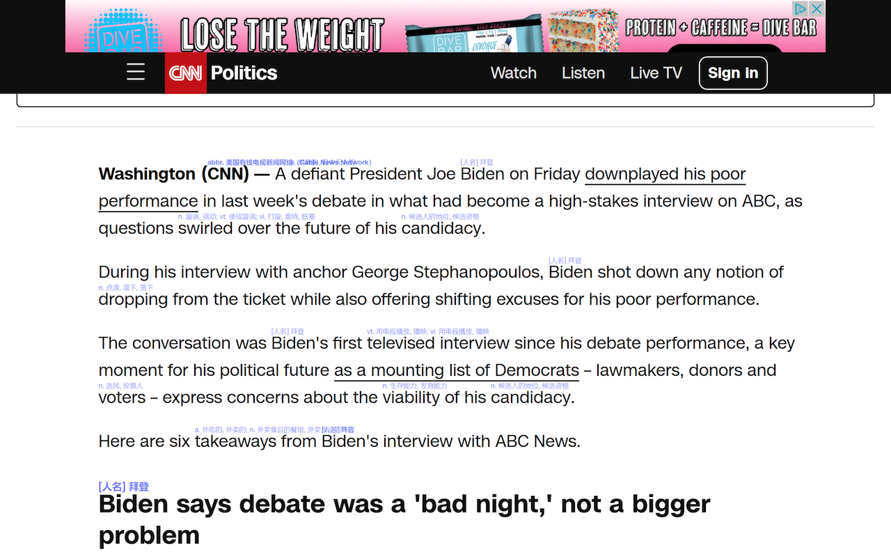
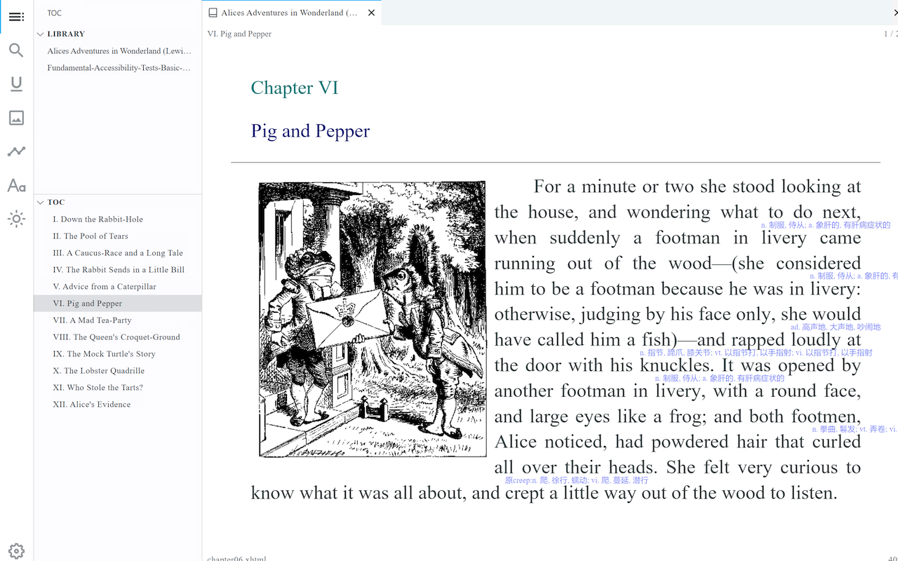

# 提交bug[置顶]

如果有意见和建议，可以[发电子邮件](mailto:mera@dingjianghao.com)或者到[github](https://github.com/jackhatedance/my-english-reading-assistant/issues)提交Bug。

# 基本功能
希望通过阅读英文书籍或者文章来提高英文水平，但是词汇量不够，手工为每一个生词查字典又嫌麻烦？这个软件就是为解决上述问题而生。

这个浏览器插件能自动在英语网页里显示陌生单词的解释。词典释义目前只支持中文，将来有可能支持英文（适合高水平用户）。

注意：这个软件不是做全文翻译的，如果想要全文翻译的功能，请使用其他软件。

# 安装
普通用户都是从浏览器的扩展市场是搜索并安装的。目前支持两个浏览器
* Google Chrome浏览器 (需要科学上网环境)
* 微软Edge浏览器 (无需科学上网环境)

国内的其他浏览器，大部分的内核与上述的浏览器是一样的，但是不知道为什么，都不支持侧边栏。所以不能完整体验该软件的功能，所以干脆放弃上架了。

如果有软件开发基础的，有可能从github下载源码，自行打包，然后打开浏览器开发者模式，就可以本地安装。

# 个人词汇表
插件安装好以后，第一步是要初始化个人词汇表。因为软件是根据词汇表来确定某个单词是否认识。在弹窗上有一个按钮可以打开设置页面。

系统默认是选用“常用8000”来初始化个人词汇表的。大部分用户都需要重新选择适合自己的词汇表进行初始化。

如何找到适合自己的词汇表？首先，要了解自己的词汇量水平。在了解了自己的词汇量以后，就可以在设置里相应的初始化词汇表了。注意，这个词汇表只是粗略的设置，想要更加精确的接近个人真实的词汇量，还需要后续的单词标记工作。一般来说，看完1，2本小说以后，集中的标记工作就告一段落了。

个人词汇表说白了就是一个文本文件，每一行一个单词。在设置页面可以复制粘贴或者编辑并保存。
如果用户自己已经有个人词汇表，则可以直接复制粘贴进来，或者直接从文本文件导入。

操作完词汇表以后需要保存。

词汇表的标记也是一项需要付出的劳动，所以要定期备份。

## 词根词缀模式

许多单词是可以拆分为词根词缀的，只要我们认识词根词缀，那么这个单词的意思就大概率是理解的。比如单词hopeless是可以拆分为hope和less.那么如果这两个单词我们都认识，就可以猜测出这个hopeless的意思。

打开词根词缀模式，软件判断某个单词是否认识的逻辑如下：

1. 该单词在个人词汇表里的有记录，那么就按照记录来判定认识或者不认识。
2. 该单词在个人词汇表里的没有记录，说明用户没有明确标记过这个单词或者清除了标记，那么在开启词根词缀模式的情况下，该单词的各个部分均是“认识”的，则认为该单词也是“认识”的。判定结束。（如果这个猜测有误，用户可以明确标记）

在侧边栏，词根和词缀都会列出来，允许用户把单词作为整体标记，也可以对词根词缀单独进行标记。

提供此模式的目的是减少单词标记的工作量, 也是非常符合大脑的记忆原理。

注意：词根数据库目前还在完善中。有一些单词的词根没有被拆分。

## 报告
设置是否启用报告功能。如果启用的话，则阅读活动会被记录下来，并可以查看相关的报告。

# 弹窗
点击浏览器右上角的插件按钮，就会出现弹窗。

点击显示就可以让当前网页展示生词的释义。

也可以为某些网站设置默认自动显示。

用户根据自己的习惯还可以调整当前网站的释义的位置，字体大小，颜色，不透明度等。

## 位置
由于释义是展示在正文的行间空隙的，所以插件默认设置的位置不一定合适，需要用户自行微调。

## 字体大小
释义字体大小相对于正文字体的比例。

## 不透明度
有时候我们阅读小说时会追求丝滑的阅读体验，即使遇到不熟悉的生词，通过上下文也可以猜测其含义。这类场景下，释义太过显眼会影响阅读正文的体验，设置不透明度低一些比较合适。

# 网页正文

为了让读者尽可能原汁原味的欣赏英文书籍，该软件尽量不破坏原有的文字布局。中文释义是用小号字体展示在行间空白处。为了不影响阅读体验，注释的不透明度默认为30%。这样做的目的，是让读者一般情况下不会被释义干扰，除非特意去看释义。

在阅读过程中，我们可能需要标记某个单词为“认识”或者“不认识”。

“认识”的单词从此不再展示其释义。

“不认识”的单词会自动展示其释义。

鼠标左键或者右键点击某个单词，都可以标记单词为“认识”或者“不认识”。

但是这种做法有一个缺点，会打断阅读体验，建议在阅读完当前页面或者章节以后，使用侧边栏来完成单词的批量标记。

# 侧边栏

侧边栏能显示当前页面的所有生词。

生词所占比例也会显示。如果比例较高，则说明阅读难度较高。一般来说低于3%是比较舒适的阅读体验。

当读者看完整篇文章或者书籍的一章，就可以使用侧边栏批量的标记单词。也有人喜欢在阅读之前先熟悉一下生词。

默认的批量标记单词的过程是首先全部不显示释义，然后按顺序逐个标记。
对于某个单词，首先说出（或者默念）自己认为的释义，然后点击显示词典释义，如果两者基本一致，则认为自己认识此单词，就可以标记为认识。否则就无需标记。
然后进行下一个单词的标记。

如果不确定某个单词自己是否认识，可以移除标记。在开启词根词缀的模式下，这个操作是有意义的。

# 报告
在设置里启用阅读报告以后可以使用该功能。数据都是保存在浏览器本地的。这个模块是为了帮助读者分析了解自己的阅读习惯，占用的时间，词汇量的增长情况。

## 词汇量变化图
可以看到过去一段时间个人词汇量的进步情况。

## 网站统计
可以看到平时常去的英文网站，所花的时间和词汇量的增长。

## 页面统计
可以看到具体页面的阅读时间和词汇量的变化。

## 阅读详情
可以看到阅读的流水账。还可以点击重新打开某个页面。

# 电子书

大部分英文小说都是以书籍的形式存在的。该插件也可以用于阅读epub格式的电子书。只要在浏览器内打开epub阅读器即可。

推荐阅读epub格式电子书的网站：https://app.flowoss.com/

一些推荐的英文书

阶段一:词汇量1k-3k
* the little prince 小王子
* charlotte's web 夏洛特的蜘蛛网
* charlie and the chocolate factory 查理和他的巧克力工厂

阶段二:词汇量3k-5k
* Flipped怦然心动(多少人的入门书!)
* The Giver赐予者
* Tuesdays with Morrie相约星期二
* The ReasonlJump我想飞进天空
* The Nightingale and the Rose夜莺与玫瑰
* Letter from an Unknown Woman一个陌生女人的来信
* The Five People You Meet in Heaven你在天堂遇见的五个人

鲁阶段三:词汇量5k-7k
* Lean in向前一步
* Animal Farm动物农场
* The Joy Luck Club喜福会
* When Breath Becomes Air当呼吸化为空气
* The Bridges of Madison County廊桥遗梦

阶段四:词汇量7k+
* Jane Eyre简爱
* Educated你当像鸟飞往你的山
* Pride and Prejudice傲慢与偏见
* The Greatest Gastby了不起的盖茨比

# 显示器
最好使用4k分辨率以上的显示器，字体比较清晰，阅读体验更好。

# 全屏模式
阅读电子书的时候，全屏模式可以尽可能减少其他视觉元素的干扰，提高阅读体验。同时建议隐藏侧边栏，目录，菜单等。 

最后，祝大家都能在这个工具的辅助下，能够顺利阅读英文小说。